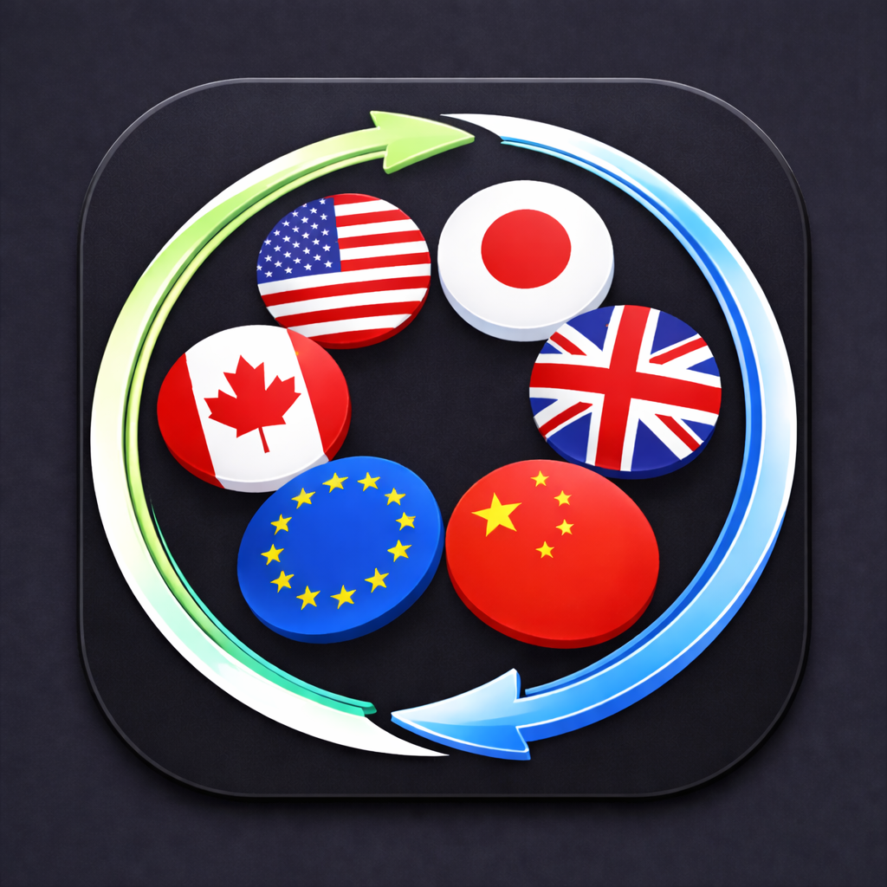

# Currency Converter

  

  

## Screenshots

  
  &nbsp;&nbsp;&nbsp;
  

## Build Instructions

1) Install dependencies:
   - `flutter pub get`
2) Regenerate envied files (after `.env` changes):
   - `dart run build_runner build --delete-conflicting-outputs`
3) Run the app:
   - `flutter run`
4) (Optional) Build release:
   - `flutter build apk` or `flutter build ios`
5) Download Android APK:
   - Grab the latest APK from the Releases section.

## Testing

Run all tests:
- `flutter test`

Run a specific test file:
- `flutter test test/feature/convert/convert_remote_data_source_test.dart`

## Architecture (Design Pattern)

The app uses a feature-based Clean Architecture with BLoC (Cubit):
- **Presentation**: `view/` + `cubit/` for UI and state changes.
- **Domain**: `entities/`, `repositories/`, `usecases/` for business logic.
- **Data**: `datasources/`, `repositories/` for API access (Frankfurter).

**Why this pattern**
- Keeps the UI thin and testable.
- Isolates API logic behind repositories and usecases.
- Scales cleanly as features grow (Convert, Charts, etc.).

## Image Loader Library

**Current choice**: Flutter built-in `Image.network`.

**Why**
- Flags are small, static assets from a stable CDN.
- Avoids extra dependencies and keeps startup light.
- Easy to replace with caching later if needed.

## Local Persistence / Database

**Current choice**: `hydrated_bloc` storage (local key-value storage under the hood).

**Why**
- Lightweight persistence for simple state (currency list, selections).
- Minimal setup compared to a full database (e.g., SQLite).
- Fits the app’s current offline needs without extra complexity.
