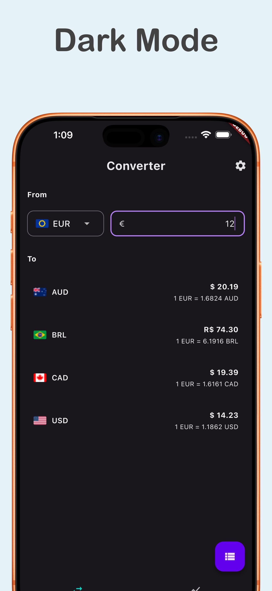
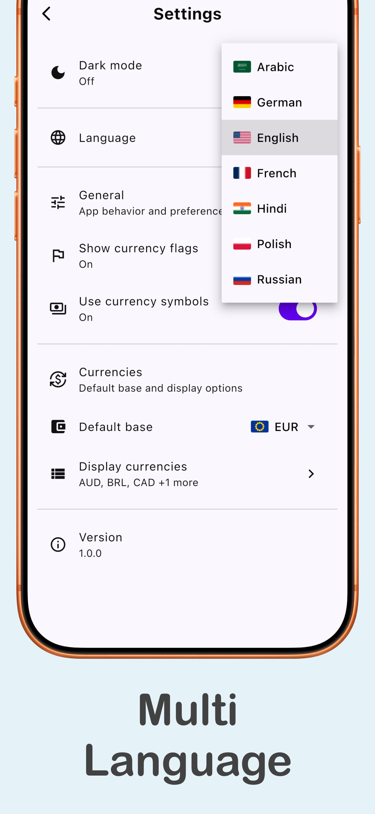

# Currency Converter App (Flutter)

Currency Converter is an open-source Flutter app for live exchange rates, historical currency charts, and multi-currency tracking in one place.

Use it to quickly convert amounts, compare multiple currencies, and follow exchange-rate trends over time.

  

  

## Quick Navigation

- [About the App](#about-the-app)
- [What It Does](#what-it-does)
- [Key Features](#key-features)
- [How to Use (Non-Technical)](#how-to-use-non-technical)
- [Open Source](#open-source)
- [Frequently Asked Questions](#frequently-asked-questions)
- [Build Instructions (For Developers)](#build-instructions-for-developers)

## Screenshots

  
  &nbsp;&nbsp;
  
  &nbsp;&nbsp;
  
  &nbsp;&nbsp;
  

## About the App

Convert currencies instantly with live exchange rates, interactive performance charts, and multi-currency tracking.

## What It Does

- Converts one base currency into many other currencies at once.
- Shows historical exchange-rate trends with easy-to-read charts.
- Remembers your preferences, so the app opens the way you like.

## Key Features

- Live exchange rates from the Frankfurter API.
- Multi-currency conversion in a single screen.
- Historical charts with ranges: `1W`, `1M`, `3M`, `1Y`, `5Y`, `10Y`.
- Swap currencies directly in charts.
- Choose a default base currency.
- Choose which currencies to display.
- Optional currency flags and currency symbols.
- Dark mode.
- Multilingual UI: English, Arabic, French, German, Hindi, Polish, Russian.

## How to Use (Non-Technical)

1. Open the app and choose your base currency (for example: `USD`, `EUR`, `GBP`).
2. Enter the amount you want to convert.
3. View your converted values instantly across selected currencies.
4. Open the **Charts** tab to see how rates changed over time, then switch the range.
5. Open **Settings** to change language, dark mode, and which currencies you want to see.

## Open Source

This project is open source and built with Flutter.

- Source code: [GitHub repository](https://github.com/KhaledEzzet/currency_converter)
- Android build: [GitHub Releases](https://github.com/KhaledEzzet/currency_converter/releases)

## Exchange Rate Note

Exchange rates come from the public Frankfurter data source and may differ slightly from your bank or payment provider.

## Frequently Asked Questions

### Is this app free and open source?

Yes. The app is open source and available on GitHub.

### Where do exchange rates come from?

Rates come from the [Frankfurter API](https://www.frankfurter.app/), a public exchange-rate data source.

### Why are rates sometimes different from my bank or card provider?

Banks and payment providers may add fees, margins, or delayed updates, so their final rates can differ from public market rates.

## Build Instructions (For Developers)

1) Install dependencies:
   - `flutter pub get`
2) Regenerate envied files (after `.env` changes):
   - `dart run build_runner build --delete-conflicting-outputs`
3) Run the app:
   - `flutter run`
4) (Optional) Build release:
   - `flutter build apk` or `flutter build ios`
5) Download Android APK:
   - Grab the latest APK from the Releases section.

## Testing

Run all tests:
- `flutter test`

Run a specific test file:
- `flutter test test/feature/convert/convert_remote_data_source_test.dart`

## Architecture (Design Pattern)

The app uses a feature-based Clean Architecture with BLoC (Cubit):
- **Presentation**: `view/` + `cubit/` for UI and state changes.
- **Domain**: `entities/`, `repositories/`, `usecases/` for business logic.
- **Data**: `datasources/`, `repositories/` for API access (Frankfurter).

**Why this pattern**
- Keeps the UI thin and testable.
- Isolates API logic behind repositories and usecases.
- Scales cleanly as features grow (Convert, Charts, etc.).

## Image Loader Library

**Current choice**: Flutter built-in `Image.network`.

**Why**
- Flags are small, static assets from a stable CDN.
- Avoids extra dependencies and keeps startup light.
- Easy to replace with caching later if needed.

## Local Persistence / Database

**Current choice**: `hydrated_bloc` storage (local key-value storage under the hood).

**Why**
- Lightweight persistence for simple state (currency list, selections).
- Minimal setup compared to a full database (e.g., SQLite).
- Fits the app’s current offline needs without extra complexity.
